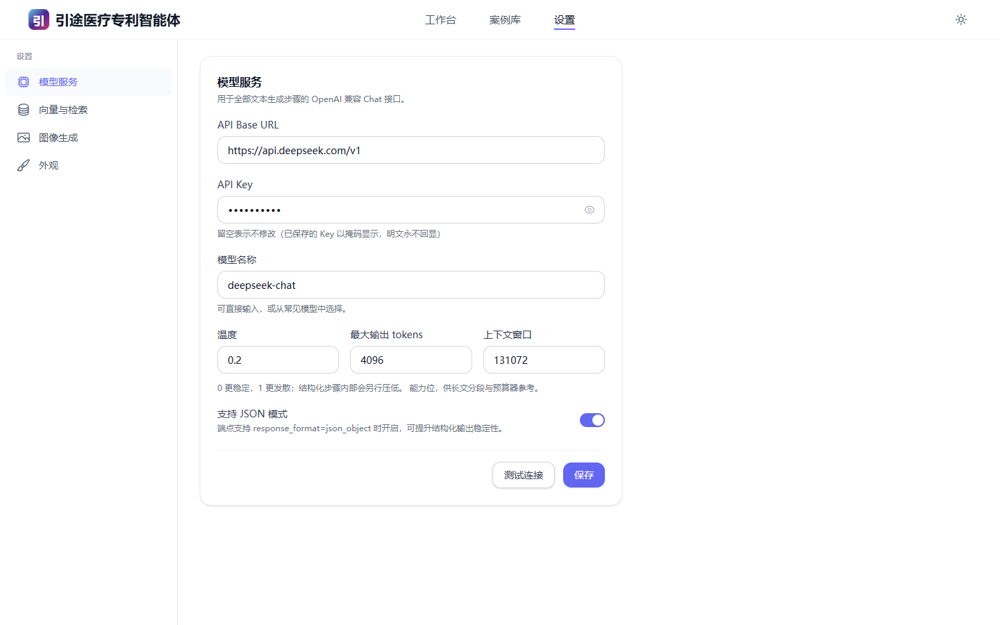

# 引途医疗专利智能体

面向医疗器械与数字医疗方向的**本地专利写作与审阅工作台**。装在自己电脑上，配一个大模型接口就能用：把项目材料、论文、专利文本或审查意见丢进来，按流程一步步产出可以交给代理机构的**专利交底书、专利申请文本、专利解读报告和审查意见答复稿**。

全部数据留在本机 `data/` 目录，除了你自己配置的大模型服务，不向任何第三方上传内容。


---

## 一、能做什么

四个模块，各自是一条**带人工确认环节的流水线**：每一步 AI 做完都会停下来给你看，你确认或修改之后才继续。

| 模块 | 你给什么 | 平台做什么 | 你拿到什么 |
|---|---|---|---|
| **专利交底书** | 项目材料（PDF / Word / PPT / Markdown / 图片），或直接文字描述 | 确认边界 → 材料消化 → 挖掘专利点 → （实用新型/外观加一步填表与线稿）→ 国知局联网查新 → 摘要预览 → 分章成文 → 自检 → 交付 | 脱敏交底书 `.md` / `.docx` / `.pdf`，含 Mermaid 流程图与可编辑 Word 公式；支持多轮迭代改稿 |
| **论文转专利** | 一篇论文 PDF | 输入评估 → 深读提取 → 起草五大部分 → 权项规则校验与装配 → 内容确认 → 附图生成 → 出文件 | 中国发明专利申请文本 `.docx` / `.pdf`（说明书摘要 / 摘要附图 / 权利要求书 / 说明书 / 说明书附图）+ 黑白专利附图 SVG/PNG + 结构化 JSON |
| **专利解读** | 一个公开号，或一份专利 PDF | 取文本 → 解析权利要求树 → 逐项白话增量 → 撰写 11 节报告 → 校对交付 | 11 节通俗解读报告 `.md` / `.docx`，站内可交互浏览权利要求树 |
| **审查意见答复** | 审查意见通知书 PDF（可另传本申请、对比文件） | 通知书结构化 → 案例库检索 → 策略选择 → 逐条起草 → 汇总交付 | 意见陈述书草稿 `.md` / `.docx`；结案后可把本案存入案例库供以后检索 |

**流水线步数**：交底书发明 8 步 / 实用新型与外观 9 步、论文转专利 7 步、专利解读 5 步、审查答复 5 步。

> **来源声明**：本平台的专利写作规则移植自 MIT 许可的开源项目 [handsomestWei/patent-disclosure-skill](https://github.com/handsomestWei/patent-disclosure-skill)；
> 其中**「论文转专利」模块的 Prompt 模板、规则文档与生成脚本来源于 [7toCR/paper2patent](https://github.com/7toCR/paper2patent)，由 7toCR 原创，非本项目原创成果**。详见 [NOTICE.md](NOTICE.md)。

### 本版明确不做的事

为免误解，先说清楚当前版本**没有**的能力：

- **不做线稿 AI 生成**。实用新型/外观需要线稿时，平台会生成一份「线稿绘制说明」，请你线下画好再上传。
- **不解析 CAD / STEP 文件**。CAD 文件只按扩展名归类提示，且按规则**永远不入交底书正文**。
- **迭代改稿只支持发明专利交底书**。实用新型、外观以及其余三个模块暂不支持迭代（可重新建案）。
- **不做电子申请、不对接专利局提交系统**。产出的是文档，递交仍走你原有渠道。
- **AI 生成内容一律需要人工核对**，平台不承担法律意义上的专业意见。

---

## 二、系统要求

| 项 | 要求 | 说明 |
|---|---|---|
| 操作系统 | Windows 10 / 11 | 脚本与 Word 导出依赖 Windows |
| Python | 3.11 – 3.13 | 安装时务必勾选 *Add python.exe to PATH* |
| Node.js | 18 及以上 | 只在首次构建界面时需要；构建完可以离线运行 |
| Microsoft Word | **可选** | 装了才能一键导出 PDF；没装则只给 `.docx`，你可自行另存为 PDF |
| Google Chrome | **可选，强烈建议** | 国知局联网查新与 Mermaid 图渲染要用；没有 Chrome 会退到 Edge，都没有则查新会转人工录入 |
| 磁盘 | 建议 3 GB 以上可用空间 | 依赖 + 运行数据 |
| 网络 | 需要能访问你配置的大模型服务；查新需要能访问国知局网站 | 全程不需要访问本项目作者的任何服务器 |

---

## 三、五分钟上手

### 1. 启动

在项目根目录（有 `start.ps1` 的那一层）：

```powershell
.\start.ps1
```

首次运行会自动创建 Python 虚拟环境、安装后端依赖、安装前端依赖并构建界面（合计约 3–8 分钟，取决于网速），然后启动服务，**等服务真正就绪后**自动打开浏览器。之后再运行通常 3 秒内起服。

如果提示「禁止运行脚本」，双击同目录的 **`start.bat`** 即可（它会以 Bypass 策略调用同一个脚本）。

常用参数：

```powershell
.\start.ps1 -Port 8080      # 换端口（8000 被占用时）
.\start.ps1 -Rebuild        # 改过前端代码后强制重新构建
.\start.ps1 -NoBuild        # 跳过前端构建，快速起后端
.\start.ps1 -NoBrowser      # 不自动开浏览器
.\start.ps1 -SetupOnly      # 只体检环境，不起服
```

按 <kbd>Ctrl</kbd>+<kbd>C</kbd> 停止服务。

启动时会打印一份本机能力体检，例如：

```
[4/5] 检查数据目录与本机能力
      [OK] 数据目录：C:\Users\you\PatentAgent\data
      [OK] 检测到 Microsoft Word，PDF 导出可用
      [OK] 检测到 Chrome，国知局联网查新与图表渲染可用
```

### 2. 配置大模型（必做一次）

打开右上角 **设置 → 模型服务**，填三样东西：



- **API Base URL** —— 任何 **OpenAI 兼容**接口都行，例如 `https://api.deepseek.com/v1`
- **API Key** —— 你在该服务商申请的密钥
- **模型名称** —— 例如 `deepseek-chat`

下面三个参数按需调整：温度（默认 0.2）、最大输出 tokens、上下文窗口（**请如实填写你所用模型的窗口大小**，平台用它做长文分段与预算，填小了会频繁切片，填大了可能超限报错）。「支持 JSON 模式」开关在端点支持 `response_format=json_object` 时打开，可提升结构化步骤的稳定性。

填完点 **测试连接**，看到绿色的「连接成功 · xxx ms」再点 **保存**。

> 交底书成文、论文转专利这类长文任务对模型能力要求较高，建议用上下文 ≥ 128K 的主力模型；能力偏弱的模型容易不守格式。

### 3. 建第一个案件

回到工作台首页，在输入框上方的分段切换器里选模块（交底书 / 论文转专利 / 专利解读 / 审查答复），把材料拖进输入框或点 `+` 上传，写一句话说明，回车发送。平台会建案并进入该模块的工作台，流水线开始跑。

之后你只需要在**每张待确认卡片**上做选择——详细的逐模块操作说明见 **[用户手册 docs/USER_GUIDE.md](docs/USER_GUIDE.md)**。

### 4. 可选：配置向量检索与图像生成

- **设置 → 向量与检索**：填一个 embedding 接口，审查答复模块的历史案例库才能做语义检索。不配也能用，会自动降级为关键词匹配，并在界面上明示当前检索模式。
- **设置 → 图像生成**：可配置图像模型并测试连通。当前版本用于导出「每图精修 Prompt」供你到外部工具出图，**流水线不会自动生成线稿**。

---

## 四、四个模块的输入与产出

### 专利交底书


- **输入**：项目技术方案、结构图、实验数据、会议纪要等，格式支持 PDF / Word(.docx) / PPT(.pptx) / Markdown / 纯文本 / 图片，单文件不超过 100 MB；也可以完全不传文件，直接在输入框描述方案。
- **产出**：`{案件名称}_{时间戳}.md`、`.docx`、`.pdf`（装了 Word 时），落在 `data/outputs/{案件ID}/`。
  - Mermaid 图会在服务端渲染成 PNG 后嵌入 Word；LaTeX 公式经 OMML 写成**可编辑的 Word 公式**。
  - 每轮迭代都**新增一个时间戳版本，绝不覆盖旧稿**，并追加「交底书修订对话记录」。
- **特别说明**：实用新型与外观设计会多一步「填表与线稿」，先把结构/外观事实固化成表，再给附图逐张打分（合格线 70），不合格或缺失的会下发线稿绘制说明。


### 论文转专利


- **输入**：一篇论文 PDF（会自动抽取正文与插图）。
- **产出**：`.docx` / `.pdf` 申请文本、附图 `.svg` / `.png`、结构化 `patent_content.json`，以及每张附图的图像模型精修 Prompt。
- **注意**：本模块的 Prompt、规则文档与生成脚本来源于开源项目 [7toCR/paper2patent](https://github.com/7toCR/paper2patent)，非本项目原创，详见 [NOTICE.md](NOTICE.md)。

### 专利解读


- **输入**：公开号（如 `CN117994321A`）或直接上传专利 PDF。公开号会尝试从公开数据源自动取全文 PDF，**取不到时会请你手工上传**（界面给出可点的候选链接）。
- **产出**：11 节解读报告 `.md`（可导出 Word），站内可交互展开权利要求树、按目录跳转。


### 审查意见答复


- **输入**：审查意见通知书 PDF；建议同时粘贴本申请权利要求书原文（用于修改对照与权项校验）。
- **产出**：意见陈述书草稿 `.md` / `.docx`，逐条对应审查员意见；涉及修改权利要求的会给出修改对照。
- **三处强制人工确认**：问题清单核对（法条与缺陷类型是 AI 提取的，**必须核对**）、相似案例勾选、答复策略选择。


- **案例库**：顶部「案例库」页可导入历史案例，**人工审核并确认后**才会进入检索库。


---

## 五、常见问题

### 大模型配不通怎么办

按顺序排查：

1. **Base URL 少了 `/v1`**。多数 OpenAI 兼容服务的正确地址形如 `https://api.deepseek.com/v1`，不是 `https://api.deepseek.com`。
2. **模型名写错**。要填服务商文档里的 model id（如 `deepseek-chat`、`qwen-plus`、`glm-4-plus`），不是产品名。
3. **Key 复制时带了空格或换行**。重新粘一次。
4. **公司网络代理拦截**。测试连接会返回超时/连接被拒；换网络或配置系统代理后重试。
5. 保存 Key 后输入框显示为掩码 `••••••`，这是正常的——**留空表示不修改**，重填才会覆盖。

### 国知局查新失败怎么办

联网查新走本机浏览器访问国家知识产权局网站，遇到网站改版、限流或网络不通都可能失败。**失败不会中断流水线**，平台会停在查新卡片上给你三个选择：

- **重试** —— 稍等片刻再试一次；
- **手工录入** —— 自己检索后把在先文献的公开号、标题、链接粘进来（平台**只允许照抄真实链接，禁止编造检索结果**）；
- **跳过** —— 交底书第 1.1 节会**如实写明"未进行检索"**，不会假装检索过。

想提高成功率：装 Google Chrome、关掉可能拦截自动化的安全软件、确保能正常打开国知局网站。

### PDF 导出失败怎么办

PDF 是用本机 Microsoft Word 转的，三级降级链是：Word → LibreOffice（若装了）→ 失败则只交付 `.docx`。

- 没装 Word/LibreOffice：这是**预期行为**，请打开导出的 `.docx` 自行「另存为 PDF」。
- 装了 Word 仍失败：多半是 Word 里有个隐藏的弹窗（激活提示、文档恢复面板、修改追踪）挡住了自动化。手动打开一次 Word、把所有弹窗点掉再关闭，然后重试导出。
- Word 正在被别的文档占用时也可能失败，关掉全部 Word 窗口再试。
- `.md` 原稿始终会先落盘，**不会因为导出失败而丢内容**。

### 端口 8000 被占用

启动脚本会直接告诉你占用的进程名和 PID：

```
启动失败：端口 8000 不可用
  - 端口 8000 已被 python（PID 45708） 占用
  - 或换个端口启动：.\start.ps1 -Port 8080
```

若那是上一次没关干净的本程序，在任务管理器结束该进程即可；否则换端口。

### 提示"禁止运行脚本"

Windows 默认的执行策略会拦 `.ps1`。两个办法：双击 **`start.bat`**，或在当前终端先执行：

```powershell
Set-ExecutionPolicy -Scope Process -ExecutionPolicy Bypass
```

### 生成到一半服务重启了，进度会丢吗

不会。每一步的执行记录都落在数据库里。重新启动后进入该案件，点**继续**（resume）即可从第一个没跑完的步骤续跑；停在人工确认环节的会重新把卡片发给你。

### 数据存在哪里，怎么备份

全部在项目根目录的 `data/` 下：

```
data/
├── app.db              SQLite 主库：案件、消息、步骤记录、设置、案例库
├── uploads/{案件ID}/    你上传的原件与自动转换出的 Markdown、抽取的插图
├── outputs/{案件ID}/    版本化交付物（时间戳命名，只增不改，永不覆盖）
└── tmp/                 临时文件，可随时清空
```

**备份**：停掉服务，整个复制 `data/` 目录即可。**还原**：把 `data/` 放回项目根目录再启动。

想换个位置存数据，在 `backend/.env` 里写 `DATA_DIR=D:\PatentData`（目录会自动创建）。

### 想删掉一个案件

侧栏案件条目 hover 后的 `…` 菜单里有删除。删除会级联清掉该案件的消息、步骤记录与交付物记录；磁盘上的文件按需清理。

---

## 六、隐私声明

这是一个**本地单用户**程序，没有注册登录，也没有任何后台服务。

- **数据不出本机**。上传的材料、生成的文稿、案件记录全部只写入本机 `data/` 目录。本项目不向作者或任何第三方回传数据、日志、遥测。
- **唯一的外发是你自己配置的服务**：（1）你在设置页填写的大模型 / embedding / 图像生成接口——生成任务的提示词与材料内容会发给它；（2）联网查新时访问国家知识产权局网站；（3）专利解读按公开号取全文时访问公开专利数据源。除此之外没有出网请求。
- **API Key 以明文存放在本地 `data/app.db`**。界面上回读时做掩码显示，但数据库文件本身是明文的。因此：**不要把 `data/` 目录或 `app.db` 分享、上传或提交到代码仓库**（`.gitignore` 已默认排除）。共用电脑请自行做磁盘加密或用系统账户隔离。
- **上传的材料可能含未公开技术信息**。平台在生成时会按脱敏规则处理正文（公司名、产品名、真实数值等抽象化），但**原始上传件是原样保存**在 `data/uploads/` 的。请按你所在单位的保密制度决定放什么进来。
- 请注意：把材料发给第三方大模型服务，是否构成"公开"、是否影响新颖性，取决于该服务商的数据条款与你单位的规定，**请自行评估**。涉密或高敏感项目建议使用私有化部署的模型接口。

---

## 七、目录结构

```
PatentAgent/
├── start.ps1 / start.bat   一键启动
├── README.md               本文件
├── NOTICE.md               来源与许可声明
├── docs/
│   ├── USER_GUIDE.md       用户手册（逐模块操作说明）
│   ├── DEVELOPMENT.md      二次开发指南
│   ├── images/             文档配图
│   └── design/             设计文档（后端架构 / 前端实现 / prompt 移植规格）
├── backend/                FastAPI 后端
│   ├── app/assets/         移植的 prompt、规则与原文快照（vendor/）
│   └── tests/              pytest 测试
├── frontend/               React SPA
└── data/                   运行时数据（自动创建，已 gitignore）
```

想改代码、加模块、跑测试，见 **[开发指南 docs/DEVELOPMENT.md](docs/DEVELOPMENT.md)**。

---

## 八、来源与许可

本项目的专利写作规则、模板、流程设计与部分工具脚本**移植自两个 MIT 许可的开源项目**：

- [handsomestWei/patent-disclosure-skill](https://github.com/handsomestWei/patent-disclosure-skill) —— 交底书流程与撰写规则、专利解读模板、审查答复流程、工具脚本
- [7toCR/paper2patent](https://github.com/7toCR/paper2patent) —— **「论文转专利」模块的 Prompt 模板、规则文档、JSON 内容契约与附图/DOCX/PDF 生成脚本来源于此项目，非本项目原创**

完整的署名、许可条款与逐项移植说明见 **[NOTICE.md](NOTICE.md)**。

> **免责声明**：本平台产出的所有内容均由大语言模型生成，可能存在事实错误、法条引用错误或表述缺陷。**请务必由具备资质的专利代理师或知识产权专业人员审核后再使用**，本项目不构成法律意见，不对因直接使用生成内容而产生的任何后果负责。
