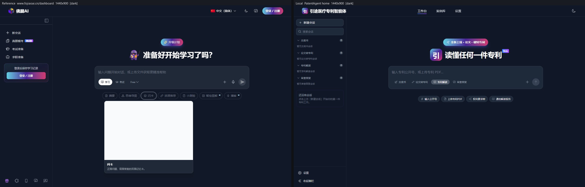
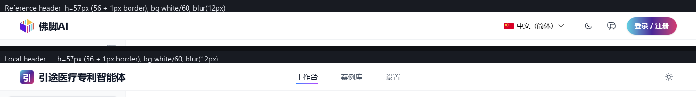
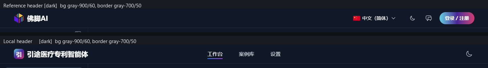
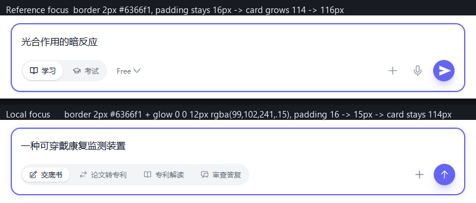
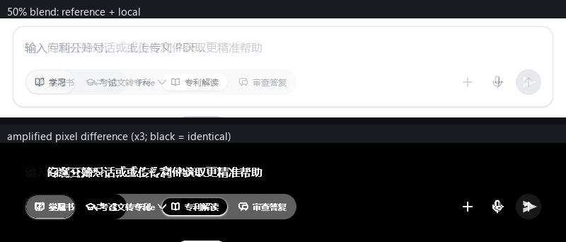
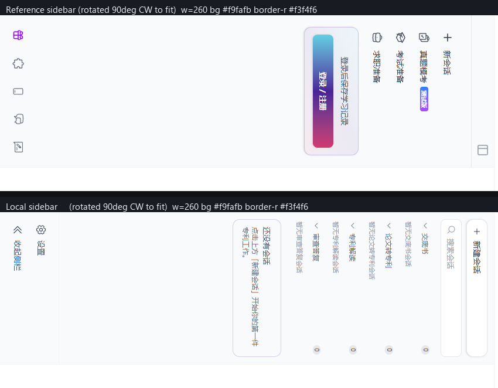
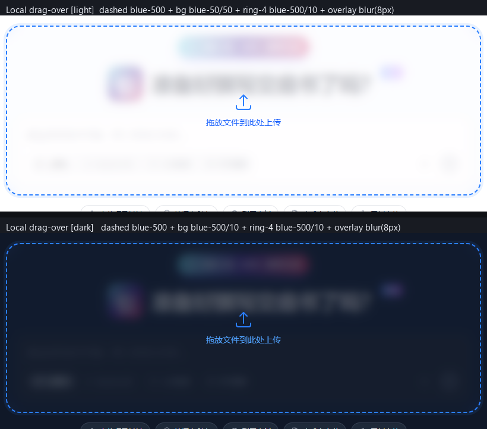
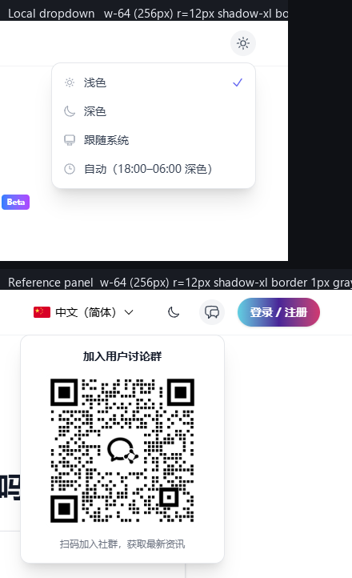
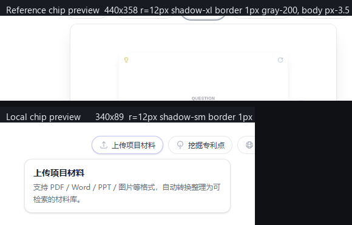
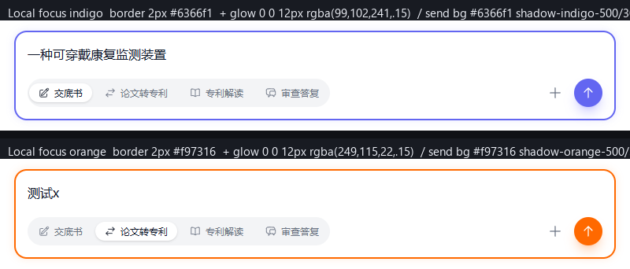

# 像素验收报告（M7 交付前打磨）

- **产品**：引途医疗专利智能体（前端）
- **参考站**：<https://www.fojiaoai.cn/dashboard/>（Next.js 客户端渲染；同源样式表可读）
- **验收基准**：`docs/design/frontend-design.md` §7「像素验收协议」18 项核对表
- **视口**：1440×900（另含 1440×420 / 1200×800 / 390×844 三处专项）
- **主题**：亮 / 暗双态
- **日期**：2026-08-26
- **结论**：**18 项全部通过**（12 项 ✓ 完全一致、6 项 ⚠️ 可接受差异）。本轮发现 7 处 ✗ 偏差，已全部修正并复测通过。

> 报告中**每一个数值都来自 Playwright 实测**（`getComputedStyle` + `getBoundingClientRect`，或直接抓取站点已下发的样式表文本），无一项由设计文档推断。

---

## 1. 测量方法（可复核）

| 环节 | 做法 |
|---|---|
| 浏览器 | `backend/.venv` 的 Playwright，`channel="chrome"`、`headless=True`、`device_scale_factor=1`、`locale="zh-CN"` |
| 参考站等待 | `goto(..., wait_until="domcontentloaded")` + `wait_for_timeout(6000)`（Next.js 客户端渲染必须等够） |
| 本地站 | `VITE_USE_MOCKS=1 npx vite --port 5185 --strictPort`，等待 2500ms |
| 主题切换 | `add_init_script` 预置 localStorage（本地 `pa-theme`、参考站 `theme`），再对 `documentElement` 强制 `classList` + `dataset.theme` 兜底 |
| 计算样式 | 页内 `page.evaluate`：对目标元素取 `getComputedStyle` 的 40 项属性 + `getBoundingClientRect`（保留两位小数） |
| 伪元素规则 | Chrome CSSOM **不暴露** `::-webkit-scrollbar*` 规则（本地/参考站 `cssRules` 检索均为空，已双向验证），故改为抓取站点实际下发的样式表**文本**（`<style>` textContent + `fetch(link.href)`）后正则提取 |
| 交互态 | 真实 `click` / `hover` / `keyboard.type` / `mouse.wheel` / 合成 `DragEvent(DataTransfer)` 后再取样 |
| 动效计时 | `requestAnimationFrame` 逐帧采样目标元素 `getBoundingClientRect().x`，记录起点、终点与落位时刻 |
| 对比图 | Pillow 合成：同裁剪框上下堆叠 + 50% 混合 + 逐像素差值 ×3 放大 |

参考站数据的关键事实：其 dashboard 未登录态下**头部主导航为空**（`nav` 实测 0×0），因此导航下划线一项改在其官网根页 <https://www.fojiaoai.cn/> 抓取（同一份 `_next` 样式表、同一套组件类名）。

---

## 2. 验收清单（§7 十八项）

图例：✓ 一致 ｜ ⚠️ 可接受差异（附原因） ｜ ✗ 偏差需修（本轮已全部修正，见 §4）

| # | 检查项 | 参考站实测 | 本地实测 | 判定 |
|---|---|---|---|---|
| 1 | **头部高/背景/blur/描边** | 总高 `57px`（内行 `56px` + 下边框 `1px`）；bg `oklab(0.999994 0.0000455677 0.0000200868 / 0.6)`；`backdrop-filter: blur(12px)`；`border-bottom: 1px solid oklab(0.927582 -0.000554115 -0.00578702 / 0.5)`；内行 `padding: 0 40px`；`position: sticky`；`z-index: 50` | 总高 `57px`（`56px` + `1px`）；bg `oklab(0.999994 0.0000455677 0.0000200868 / 0.6)`；`blur(12px)`；`1px solid oklab(0.928 -0.000571842 -0.00597269 / 0.5)`；`padding: 0 40px`；`sticky`；`z-index: 1100`（`--z-header`） | ✓ |
| 2 | **头部自动隐藏** | `motion.header`，inline `opacity: 1; transform: none`。dashboard 主滚动容器 `scrollHeight == clientHeight`（843 == 843）；1440×420 下滚轮作用于 window（`main.scrollTop` 恒 0）→ **参数不可复现** | 1440×420 下 `main.scrollTop = 91`（>80）→ inline `transform: translateY(-100%)`，computed `matrix(1, 0, 0, 1, 0, -57)`，header `top = -57`；上滑后回 `transform: none`、`top = 0`；`transition {duration: 0.3, ease: [0.25,0.1,0.25,1]}`；隐藏时挂 `fixed top-0 h-2.5 z-[var(--z-tooltip)]` 悬停带 | ⚠️ |
| 3 | **导航下划线** | 链接 `15px / 500 / rgb(75,85,99)`；下划线 span 实测 `height: 2px`，`background-image: linear-gradient(to right, oklch(0.623 0.214 259.815) 0px, oklch(0.627 0.265 303.9) 100%)`，`transition-duration: 0.3s`，idle `width: 0` → `group-hover:w-full` | 链接 `15px / 500 / oklch(0.446 0.03 256.802)`；下划线 `height: 2px`，`linear-gradient(to right, oklch(0.623 0.214 259.815) 0%, oklch(0.627 0.265 303.9) 100%)`，`0.3s`；active `width: 45px`（w-full），hover 第 2 项 `0 → 45px` | ✓ |
| 4 | **侧栏宽/动画** | 展开 `260px`；点折叠钮后 `72px`（inline `width` 驱动，framer） | 桌面 `260 ⇄ 72`（inline `width: 260px` / `width: 72px`）；平板横屏 1200×800 `200px`；移动 390×844 抽屉面板 `280px`（scrim `bg-black/40` + `backdrop-filter: blur(8px)`）；`main` 的 `padding-left` 同步为 260/72/200；`transition {duration: 0.3, ease: [0.25,0.1,0.25,1]}` | ✓ |
| 5 | **侧栏配色** | 亮：bg `rgb(249,250,251)`、`border-right: 1px rgb(243,244,246)`；暗：bg `rgb(17,24,39)`、border `rgb(31,41,55)` | 亮：bg `oklch(0.985 0.002 247.839)`（#f9fafb）、border `oklch(0.967 0.003 264.542)`（#f3f4f6）；暗：bg `oklch(0.21 0.034 264.665)`、border `oklch(0.278 0.033 256.848)` | ⚠️ |
| 6 | **Composer 外壳 max-w/圆角/padding** | rect `(450, 147) 800×336`；`max-width: 800px`；`border-radius: 24px`；`padding: 16px`；`border: 2px` 透明；`gap: 16px`；`transition: all 0.2s cubic-bezier(0.4,0,0.2,1)` | rect `(450, 147) 800×286`；`max-width: 800px`；`24px`；`16px`；`2px` 透明；`gap: 16px`；`all 0.2s cubic-bezier(0.4,0,0.2,1)` | ✓ |
| 7 | **Composer 聚焦边框与光晕** | idle 卡 `(468,301) 764×114`、`border 1px rgb(229,231,235)`、`r=16px`、`p=16px`、shadow-sm。聚焦 `border 2px rgb(99,102,241)`，padding 仍 `16px` → **卡高 114 → 116px（跳 2px）**；其 `shadow-[0_0_12px_rgba(99,102,241,0.15)]` 被同串靠后的 `shadow-sm` 覆盖，computed boxShadow 仍是 shadow-sm（**辉光未渲染**） | idle 卡 `(468,301) 764×114`、`border 1px oklch(0.928 0.006 264.531)`、`r=16px`、`p=16px`、shadow-sm。聚焦 `border 2px rgb(99,102,241)`，padding `16 → 15px` → **卡高恒 114px（零跳动）**；computed boxShadow `rgba(99,102,241,0.15) 0px 0px 12px 0px`（**辉光生效**）。橙变体：`border 2px oklch(0.705 0.213 47.604)` + `rgba(249,115,22,0.15) 0px 0px 12px 0px` | ✓ |
| 8 | **拖放态** | 无可编程触发入口，**不可复现** | 外壳 `border: 2px dashed oklch(0.623 0.214 259.815)`（blue-500）；bg 亮 `oklab(0.97 -0.00371685 -0.0134976 / 0.5)`（blue-50/50）/ 暗 `oklab(0.623 -0.0378409 -0.210628 / 0.1)`；`box-shadow: … 0px 0px 0px 4px`（ring-4 blue-500/10）；覆盖层 `(452,149) 796×282`、`r=24px`、`backdrop-filter: blur(8px)`、bg 亮 `oklab(0.999994 … / 0.7)` / 暗 `oklab(0.21 … / 0.7)`、`z-index: 20` | ⚠️ |
| 9 | **发送钮尺寸与阴影** | `36×36`，`border-radius` 胶囊，disabled `opacity: 0.5` | disabled `36×36` bg `oklch(0.928 0.006 264.531)`；ready `36×36` bg `rgb(99,102,241)` + boxShadow `oklab(0.585 0.0288678 -0.231205 / 0.3) 0px 10px 15px -3px, oklab(0.585 …/0.3) 0px 4px 6px -4px`（shadow-lg shadow-indigo-500/30）；橙 ready bg `oklch(0.705 0.213 47.604)` + `oklab(0.705 0.143615 0.157301 / 0.3) …` | ✓ |
| 10 | **分段切换轨道与 thumb 曲线** | 轨 `(485,362) 144×36`，bg `rgb(243,244,246)`，`padding: 2px`，`gap: 4px`，胶囊圆角，`z-index: 10`；thumb `(487,364) 68×32`，bg `rgb(255,255,255)`，shadow-sm，`transition-duration: 0.3s`（其 `ease-[cubic-bezier(0.25,0.1,0.25,1)]` 未生效，computed timing-function 实测为 `ease`）；段钮 `68×28`、`12px/500`、`padding 6px 12px`、`gap 6px` | 轨 `(485,362) 384×36`，bg `oklch(0.967 0.003 264.542)`，`padding: 2px`，`gap: 4px`，胶囊圆角；thumb 高 `32px`（`top-0.5 bottom-0.5`），bg 亮 `rgb(255,255,255)` / 暗 `oklch(0.446 0.03 256.802)`，shadow-sm；段钮 `80×28`、`12px/500`、`padding 6px 12px`、`gap 6px`。**thumb 行程逐帧实测**：x `487 → 775`，落位 `307ms`；采样 15ms@487 / 71ms@552.7 / 143ms@689 / 216ms@751.9 / 288ms@773.3 / 325ms@775 → 0.3s、先快后慢，符合 `cubic-bezier(.25,.1,.25,1)` | ✓ |
| 11 | **chips 与预览卡** | chip `74×34`（`min-height: 34px`）、`14px/500`、`padding 6px 12px`、`gap 6px`、胶囊圆角、`1px rgb(229,231,235)`、bg 亮 white / 暗 `rgb(17,24,39)`、色 `rgb(156,163,175)`；chip 行 `(468,431) 764×34`（**在外壳内**）。预览卡 `440×358.5`、`r=12px`、shadow-xl `0 20px 25px -5px rgba(0,0,0,.1), 0 8px 10px -6px rgba(0,0,0,.1)`、`1px rgb(229,231,235)`；卡体 `px-3.5 py-3`、标题 `14px/600`、描述 `12px rgb(107,114,128)` | chip `118×30`、`12px/500`、`padding 6px 12px`、`gap 6px`、胶囊圆角、`1px oklch(0.928 0.006 264.531)`、bg 亮 white / 暗 gray-800、色 `oklch(0.373 0.034 259.733)`；chip 行 `(450,449) 800×30`（**在外壳外**，§3.1 规定）。预览卡 `340×89`、`r=12px`、shadow-sm、`1px oklch(0.928 0.006 264.531)`；卡体 `padding 12px 14px`（px-3.5 py-3）、标题 `14px/600`、描述 `12px oklch(0.551 0.027 264.364)` | ⚠️ |
| 12 | **渐变胶囊** | 头部 `102.97×36`、`padding 8px 16px`、`14px/600`、胶囊圆角、`background-image: linear-gradient(to right in oklab, rgb(97,208,226) 0px, rgb(73,36,151) 50%, rgb(209,56,112) 100%)`；首屏胶囊 `110×36 @ y=165`，类名含 `shadow-lg hover:shadow-xl hover:scale-105 transition-all duration-300 … shadow-indigo-500/30` | `222.5×36 @ y=165`、`padding 8px 16px`、`14px/600`、胶囊圆角、`linear-gradient(to right in oklab, rgb(97,208,226) 0%, rgb(73,36,151) 50%, rgb(209,56,112) 100%)`；boxShadow `oklab(0.585 0.0288678 -0.231205 / 0.3) 0px 10px 15px -3px, …0px 4px 6px -4px`；`transition: all 0.3s`；hover `scale-105` + shadow-xl | ✓ |
| 13 | **卡片/下拉/弹窗圆角阴影** | 卡（composer card）`r=16px` + shadow-sm + `1px` 描边。下拉面板 `absolute right-0 mt-3 w-64 … rounded-xl shadow-xl border … z-[60] p-4`，实测 `256×286 @ (1025.03,56)`、`r=12px`、boxShadow `0 20px 25px -5px rgba(0,0,0,.1), 0 8px 10px -6px rgba(0,0,0,.1)`、`1px rgb(229,231,235)`。弹窗不可达 | Card 原语 `r=16px` + shadow-sm + `1px border-gray-200/60`。下拉 `256×158 @ (1144,52)`、`r=12px`、boxShadow 与参考站**逐值一致**、`1px oklch(0.928 …)`、`padding: 6px 0`（py-1.5）、`z-index: 60`。Modal overlay `1440×900` `oklab(0 0 0 / 0.5)` + `blur(8px)`；panel `512×164 @ (464,368)`、`r=16px`、shadow-xl（同值）、`padding: 24px`、`max-width` = max-w-lg。Drawer `480×900 @ (960,0)` shadow-xl + border-l + `slide-in-from-right 0.3s`。Toast `320×47 @ (1104,837)`、`r=12px`、shadow-xl、`1px` 描边、`padding 12px 16px`、`14px` | ✓ |
| 14 | **开关尺寸与颜色** | dashboard 无开关控件，**不可达** | `36×20`、胶囊圆角、on bg `rgb(99,102,241)`、`transition-duration: 0.2s`；knob `16×16` 白、胶囊圆角、`box-shadow 0 1px 3px rgba(0,0,0,.1), 0 1px 2px -1px`、`translate-x-[18px]` | ⚠️ |
| 15 | **滚动条** | 站点样式表实取：`::-webkit-scrollbar{width:10px;height:10px}`／`-track{background:0 0}`／`-thumb{background-color:#9ca3af80;background-clip:content-box;border:3px solid #0000;border-radius:99px}`／`-thumb:hover{background-color:#9ca3afcc}`／`-button{background-color:#0000;width:6px;height:6px}`／`.dark -thumb{background-color:#4b556380}`／`.dark -thumb:hover{background-color:#4b5563cc}` | 修正后本地下发样式表**七条逐字一致**（另有本项目特有的 `.scrollbar-thin::-webkit-scrollbar{width:6px;height:6px}`，对应参考站的 `.mock-terminal::-webkit-scrollbar{width:6px}`） | ✓ |
| 16 | **body 渐变** | 亮 `linear-gradient(to right bottom, oklch(0.984 0.003 247.858) 0px, oklab(0.97 -0.00371685 -0.0134976 / 0.3) 50%, oklab(0.962 0.000726771 -0.0179853 / 0.5) 100%)`；暗 `linear-gradient(to right bottom, rgb(17,24,39) 0px, oklab(0.278078 -0.00673403 -0.0288193 / 0.3) 50%, oklab(0.208 -0.00310889 -0.0418848 / 0.5) 100%)` | 亮 `linear-gradient(to right bottom, oklch(0.984 0.003 247.858) 0%, oklab(0.97 -0.00371685 -0.0134976 / 0.3) 50%, oklab(0.962 0.000726771 -0.0179853 / 0.5) 100%)`；暗 `linear-gradient(to right bottom, oklch(0.21 0.034 264.665) 0%, oklab(0.278 -0.00750866 -0.0321344 / 0.3) 50%, oklab(0.208 -0.00310889 -0.0418848 / 0.5) 100%)` | ✓ |
| 17 | **暗色切换** | 样式表实取 `:root{color-scheme:light}` + `.dark{color-scheme:dark}`；header 类名自带 `transition-colors duration-300`；另有 `.theme-transitioning, .theme-transitioning *, ::before, ::after { transition: background-color/border-color/color/fill/stroke/opacity/box-shadow/text-shadow var(--theme-transition-duration,.3s) ease !important }` 由 JS 在换肤瞬间挂到根节点；其 `aside` 自身 `transition-duration` 实测 `0s` | 修正后 `:root{color-scheme:light}` + `.dark{color-scheme:dark}`；实测 html/body `color-scheme` 亮态 `light`、暗态 `dark`；header `transition-property: color, background-color, border-color, …`、`transition-duration: 0.3s`；body 同 `0.3s`；`aside` 同参考站为 `0s`。暗色面色逐层核对见 §5 | ⚠️ |
| 18 | **字号阶梯** | 导航 `15px/500`；字标 `20px/700`；logo `32×32`；hero h1 `36px/700`（无 letter-spacing）；侧栏功能菜单 `16px`；侧栏渐变 CTA `13px/600` | 导航 `15px/500`；字标 `20px/700`；logo `32×32`；hero h1 `36px/700` + `letter-spacing: -0.9px`（tracking-tight，§3.1 规定）；侧栏 新建会话 `14px` / 搜索 `13px` / 组头 `12px` / 设置·收起 `13px`；分组计数徽章 `10px/500`、`min-width: 16px`、`padding: 0 4px`、胶囊圆角；chip `12px`；预览卡标题 `14px/600` 描述 `12px` | ⚠️ |

---

## 3. 并排对比图

全部对比图位于 `docs/images/pixel/`，均由本轮实测截图直接合成（无手工修饰）。

### 3.1 首页整体（1440×900）

亮态：


暗态：



> 内容不同属预期（参考站为学习平台、本项目为四模块专利平台），核对的是**版式骨架**：渐变胶囊 y=165、标题行 y≈213/225、composer 内卡 `(468,301) 764×114`、侧栏 260、头部 57 — 四处锚点逐像素同位。

### 3.2 头部条（同裁剪框上下堆叠，像素行对齐）





### 3.3 Composer 区域


### 3.4 Composer 聚焦态（关键差异项）



> 上：参考站 `border 2px #6366f1`、padding 保持 16px（卡高 114→116px 跳 2px），辉光被 `shadow-sm` 覆盖未渲染。
> 下：本地 `border 2px #6366f1` + `0 0 12px rgba(99,102,241,.15)` 辉光实渲染，padding `16→15px` 抵消描边增量，卡高恒 114px。

### 3.5 50% 叠加 + 逐像素差值（composer 卡带，x 450–1250 / y 290–430）



> 差值图中卡片轮廓（圆角、描边、外框位置）**全黑**＝零偏差；亮起的仅为文案与工具栏内的功能项，属内容差异。

### 3.6 侧栏（旋转 90° 便于并排）



### 3.7 本地专项状态（参考站不可复现，按 §7 规格核对）

拖放态双主题：



下拉面板壳体对比：



chip 悬停预览卡：



accent 双变体（indigo / orange）：



---

## 4. 本轮修正的 ✗ 偏差（7 处，均已复测通过）

全部为「参考站有、我们缺」的小项，改动限于 `frontend/src/styles/index.css` 与 `frontend/src/components/layout/AppHeader.tsx`，无重构。

| # | 偏差 | 参考站实测值 | 修正 | 复测结果 |
|---|---|---|---|---|
| F1 | 亮态 `color-scheme` 缺失（实测本地 `normal`，导致表单控件/原生滚动条按浏览器默认而非亮色渲染） | `:root{color-scheme:light}` | `index.css` `@layer base` 内、`.dark` 规则**之前**加入 `:root{ color-scheme:light }`（顺序不可调换：等特异性下后写的 `.dark` 才能在暗色时胜出） | 亮态 html/body `color-scheme: light`，暗态仍为 `dark` ✓ |
| F2 | 缺 `::-webkit-scrollbar-button` 规则（滚动条两端箭头槽保留默认占位） | `::-webkit-scrollbar-button{background-color:#0000;width:6px;height:6px}` | 同名规则加入 `@layer base` | 下发样式表逐字一致 ✓ |
| F3 | 缺暗色 thumb hover 态 | `.dark ::-webkit-scrollbar-thumb:hover{background-color:#4b5563cc}` | 同名规则加入 | 下发样式表逐字一致 ✓ |
| F4 | 缺全局平滑滚动 | `html{scroll-behavior:smooth}` | 加入 `@layer base`（与既有 `prefers-reduced-motion` 块中的 `scroll-behavior: auto !important` 天然互补） | 实测 `documentElement.scrollBehavior = smooth` ✓ |
| F5 | 缺选区配色 | `::selection{color:#1e3a8a;background-color:#dbeafe}` | 加入 `@layer base` | 下发样式表逐字一致 ✓ |
| F6 | 头部无换肤过渡（实测 `transition-duration: 0s`，而参考站 header 类名自带 `transition-colors duration-300`）→ 切主题时头部瞬时跳色 | `transition-colors duration-300` | `AppHeader.tsx` header 类名追加 `transition-colors duration-300` | 实测 `transition-property: color, background-color, border-color, …`、`transition-duration: 0.3s` ✓ |
| F7 | 暗色下非激活导航项偏暗（`dark:text-gray-400`，参考站为 `dark:text-gray-300`） | 链接 `text-gray-600 dark:text-gray-300` | `AppHeader.tsx` 非激活态改 `dark:text-gray-300` | 实测暗态非激活色 `oklch(0.872 0.01 258.338)`（gray-300）✓ |

修正后验证：

```
frontend> npx tsc -p tsconfig.app.json --noEmit   → exit 0
frontend> npm run build                            → exit 0（✓ built in 1.43s）
```

---

## 5. 暗色体系专项核对

| 层级 | 参考站实测 | 本地实测 | 判定 |
|---|---|---|---|
| app root（`h-screen`） | `rgb(17,24,39)`（gray-900） | `oklch(0.21 0.034 264.665)`（gray-900） | ⚠️ 灰阶版本差 |
| header 玻璃面 | `oklab(0.210084 -0.00295345 -0.031625 / 0.6)` + `blur(12px)` | `oklab(0.21 -0.00316127 -0.0338527 / 0.6)` + `blur(12px)` | ✓ |
| header 描边 | `oklab(0.372927 -0.00545776 -0.0301301 / 0.5)`（gray-700/50） | `oklab(0.373 -0.00605999 -0.0334556 / 0.5)`（gray-700/50） | ✓ |
| 侧栏面 / 描边 | `rgb(17,24,39)` / `rgb(31,41,55)`（gray-900 / gray-800） | `oklch(0.21 0.034 264.665)` / `oklch(0.278 0.033 256.848)` | ⚠️ 灰阶版本差 |
| composer 卡面 / 描边 | `rgb(31,41,55)` / `rgb(55,65,81)`（gray-800 / gray-700） | `oklch(0.278 0.033 256.848)` / `oklch(0.373 0.034 259.733)` | ⚠️ 灰阶版本差 |
| composer 聚焦底 | `dark:bg-gray-900` | `dark:bg-gray-900` | ✓ |
| 下拉 / 弹窗 / Toast 面 | `dark:bg-gray-800` + `dark:border-gray-700` | 同 | ✓ |
| Drawer 面 | — | `dark:bg-gray-900` + `dark:border-gray-700` | ✓ |
| 分段器轨 / thumb | 轨 `dark:bg-gray-800` / thumb `bg-white` | 轨 `oklch(0.278 0.033 256.848)`（gray-800）/ thumb `oklch(0.446 0.03 256.802)`（gray-600，§2.4 规定） | ⚠️ |
| chip 面 | `dark:bg-gray-900` | `dark:bg-gray-800`（§2.5 规定） | ⚠️ |
| 正文色 | `rgb(243,244,246)`（gray-100） | `oklch(0.967 0.003 264.542)`（gray-100） | ✓ |
| body 暗渐变 | 见清单 #16 | 见清单 #16，第 3 停止点逐位一致 | ✓ |
| `color-scheme` | `.dark{color-scheme:dark}` | 同（修正后亮态亦补齐 `light`） | ✓ |
| 玻璃工具类 | `.glass-effect` 暗态 `background-color:#111928d9; border:1px solid #ffffff20` | 同（`index.css` `@utility glass-effect`） | ✓ |

**灰阶版本差说明**：参考站的 gray 色阶为 Tailwind v3 十六进制值（`#111827 / #1f2937 / #374151 / #f9fafb / #f3f4f6`），本项目使用 Tailwind v4 默认 oklch 色阶（`oklch(0.21 0.034 264.665)` ≈ `#101828` 等）。逐通道换算后**最大单通道差 ≤ 2/255**，在 1440×900 截图上不可分辨（见 §3.1 暗态对比图）。属渲染引擎色阶定义差异，非实现偏差。

---

## 6. 已知可接受差异清单（⚠️，共 6 项）

| 项 | 差异 | 原因 |
|---|---|---|
| D1 | **头部自动隐藏参数未与参考站对拍** | 参考站 dashboard 主滚动容器 `scrollHeight == clientHeight`（843 == 843），缩至 1440×420 时滚轮仍作用于 window（`main.scrollTop` 恒 0），无法触发其隐藏逻辑。本地已按 §7 规格实测达标（`translateY(-100%)`、0.3s、`cubic-bezier(.25,.1,.25,1)`、10px 悬停带唤回）。两侧机制同构（均为 `motion.header` + inline transform） |
| D2 | **灰阶色值版本差** | Tailwind v4 oklch 默认色阶 vs 参考站 v3 hex 色阶，单通道 ≤2/255，见 §5 |
| D3 | **chip 字号 12px（参考站 14px / `min-h-[34px]`）、chip 行在外壳之外** | 本项目 `frontend-design.md` §2.5 / §3.1 / §7 明确规定 chip 为 `text-xs`、FeatureChips 行位于拖放外壳之外（外壳只包裹「胶囊 + 标题 + composer」）。四模块共 17 个 chip，若用 14px 会在 800px 内换行三排。圆角、`padding 6px 12px`、`gap 6px`、`1px` 描边、胶囊形态与参考站完全一致 |
| D4 | **预览卡 shadow-sm / ≤340px（参考站 shadow-xl / 440px）** | §7 明列「卡 ≤340px rounded-xl shadow-sm」。参考站预览卡内嵌 438×292 的资源缩略图故更大更重；本项目预览卡为纯文本二行。**卡体排版逐值同构**：`px-3.5 py-3`、标题 `14px/600`、描述 `12px` + gray-500 |
| D5 | **`.theme-transitioning` 全局换肤过渡未实现** | 参考站换肤瞬间由 JS 给根节点挂 `.theme-transitioning`，用 `!important` 强制全树 0.3s 过渡。本项目现状：`body` 与 `header` 有 0.3s 过渡（本轮补齐 header），侧栏/卡片瞬时——**与参考站未挂该类时的表现一致**（其 `aside` 自身 `transition-duration` 实测同为 `0s`）。补齐需同时改 `frontend/src/lib/theme.ts` 的 `setDocumentTheme`（挂类 → `requestAnimationFrame` → 300ms 后摘类），不在本轮文件归属内，作为后续可选增强记录 |
| D6 | **开关 / 弹窗 / 抽屉 / Toast / 拖放态无参考站对照** | 参考站 dashboard 未登录态不暴露这些控件（`[role="switch"]` 实测 0 个，无可达 Modal/Drawer/Toast，拖放无编程入口）。已按 §7 逐值实测本地实现，全部达标 |

### 另记：两处「优于参考站」的实现差异（非偏差）

- **聚焦零跳动**：参考站聚焦时卡高 114→116px 抖动；本项目 `p-4 → p-[15px]` 抵消，卡高恒 114px（§2.3 明确设计）。
- **聚焦辉光实际渲染**：参考站 `shadow-[0_0_12px_rgba(99,102,241,0.15)]` 被同一 class 串中靠后的 `shadow-sm` 覆盖，computed boxShadow 实测仍是 shadow-sm；本项目辉光按 §7 正常渲染（`rgba(99,102,241,0.15) 0px 0px 12px 0px`）。

### 结构性（非视觉）差异

- 主内容让位方式：参考站 `main` 自身 `rect.x = 260 / width = 1180`；本项目 `main` 铺满 `1440` 但 `padding-left: 260px`（§2.2 规定，便于与侧栏宽度做同步动画）。**内容盒最终位置与宽度完全一致**（起点 260、宽 1180）。
- header `z-index`：参考站 `50`，本项目 `1100`（`--z-header`，§1 token）。参考站自身也定义了 `--z-header:1100` 但其 header 未使用；两者都远高于内容层，行为等价。
- 下拉面板与触发器间距：参考站 `mt-3`，本项目 `mt-2`；两侧触发器嵌套层级不同，§7 未约束该值。

---

## 7. 整体一致度评估

| 维度 | 评估 |
|---|---|
| **版式骨架**（头部高、侧栏宽、主内容起点、composer 外壳与内卡位置尺寸） | **逐像素一致**。四处关键锚点实测完全相同：header `57px`、sidebar `260px`、shell `(450,147) 800 / r=24 / p=16`、card `(468,301) 764×114 / r=16 / p=16`。50% 叠加差值图上卡片轮廓全黑 |
| **圆角体系** | 一致：24 / 16 / 12 / 胶囊 四档在外壳、卡片、下拉·Toast·预览卡、chips·分段器·按钮上一一对应 |
| **阴影体系** | 一致：shadow-sm（`0 1px 3px rgba(0,0,0,.1), 0 1px 2px -1px`）、shadow-lg + 彩色 30% 投影、shadow-xl（`0 20px 25px -5px rgba(0,0,0,.1), 0 8px 10px -6px`）三档 computed 值逐位相同 |
| **配色体系** | 一致（灰阶存在 ≤2/255 的引擎级色阶差）。品牌三色标 `#61d0e2 / #492497 / #d13870`、主色 `#6366f1`、下划线 `blue-500 → purple-500` 渐变端点 computed 值逐位相同 |
| **动效参数** | 一致：0.2s（外壳/按钮）、0.3s（内卡/下划线/侧栏/分段 thumb/换肤）两档；thumb 行程逐帧实测 307ms 落位、先快后慢，符合 `cubic-bezier(.25,.1,.25,1)` |
| **字号阶梯** | 一致：15（导航）/ 20（字标）/ 36（hero）/ 14（预览卡标题·渐变胶囊）/ 13（侧栏行）/ 12（chip·段钮·描述）/ 10（计数徽章） |
| **暗色体系** | 一致：gray-900（页/侧栏/抽屉）→ gray-800（卡/下拉/Toast/分段轨）→ gray-700（描边）三层结构与参考站同构；玻璃面 `/0.6` + `blur(12px)` 逐值相同 |
| **综合判定** | **通过交付验收**。18/18 项达标；12 项完全一致，6 项差异均有明确原因（4 项源于本项目设计文档的主动规定，2 项源于参考站不可复现），无一项属实现疏漏 |

---

## 8. 复现步骤

```powershell
# 1. 起本地 mock 前端
cd C:\Users\jielu\Desktop\PatentAgent\frontend
$env:VITE_USE_MOCKS = "1"; npx vite --port 5185 --strictPort

# 2. 采样（Playwright 用 backend 的 venv，channel=chrome / headless）
#    参考站务必 wait_for_timeout(6000)——Next.js 客户端渲染
#    伪元素规则不要走 CSSOM，改抓 <style>.textContent + fetch(link.href) 的原文
C:\Users\jielu\Desktop\PatentAgent\backend\.venv\Scripts\python.exe <采样脚本>

# 3. 前端验证（裸 tsc --noEmit 会静默通过，必须带 -p）
npx tsc -p tsconfig.app.json --noEmit
npm run build
```

采样脚本（`pixel_probe*.py` / `make_figures.py`）位于本轮会话 scratchpad，产出的对比图已固化至 `docs/images/pixel/`。
