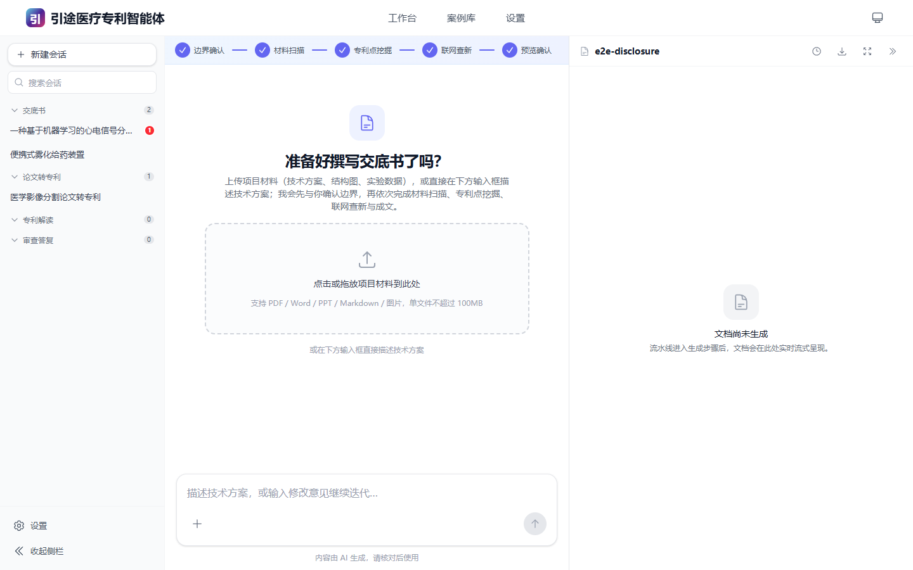
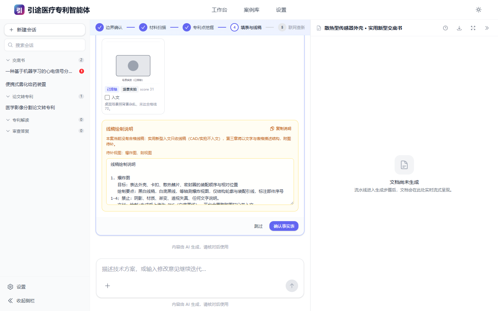
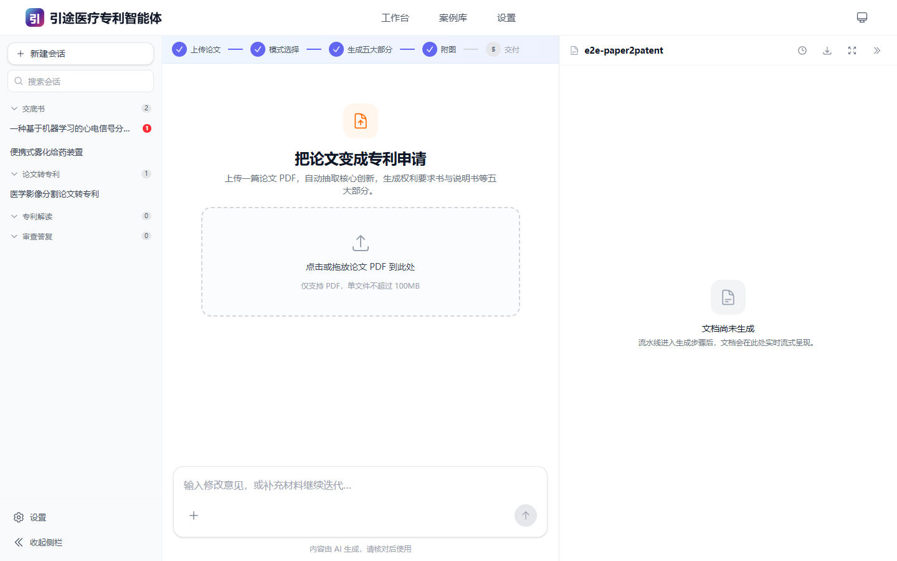
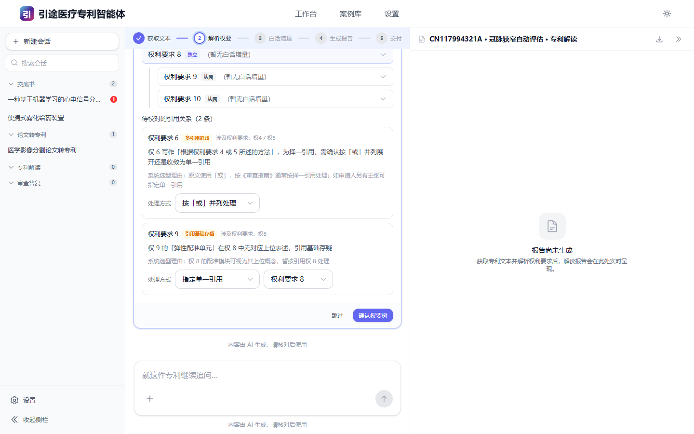
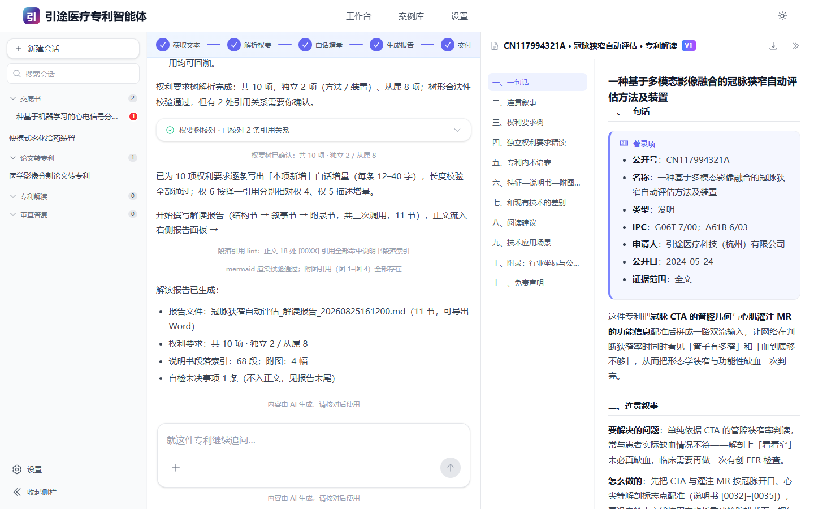
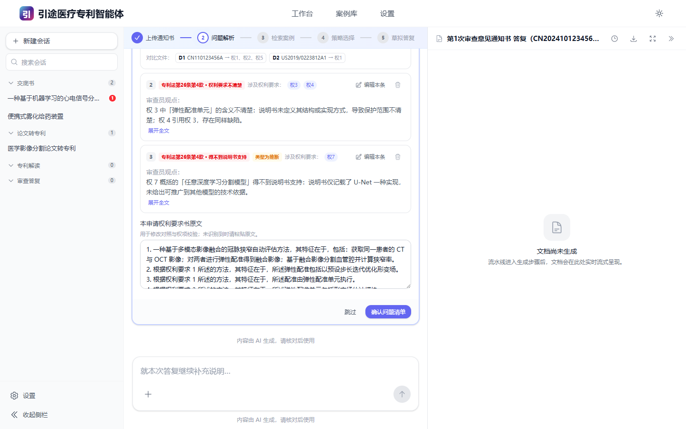
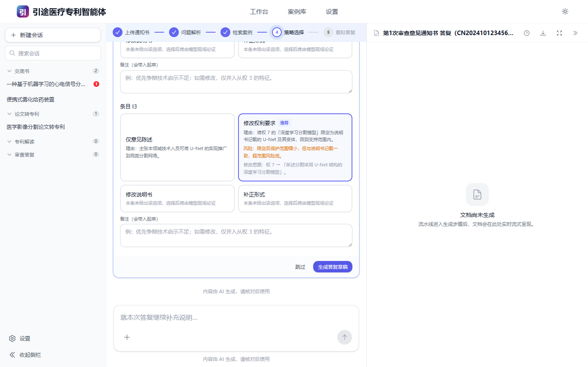
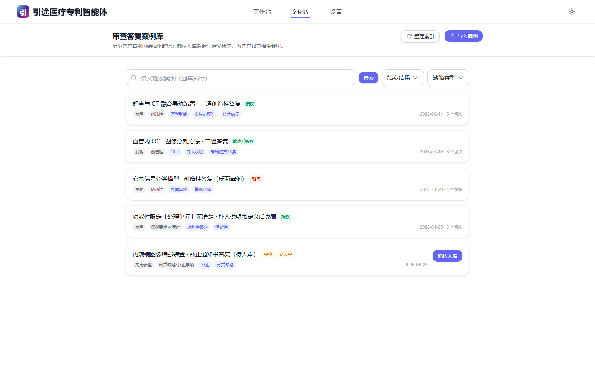

# 引途医疗专利智能体 · 用户手册

本手册逐模块讲清楚**每一步该做什么、界面上会看到什么、要填什么**。
只想快速跑起来看 [README](../README.md) 的「五分钟上手」即可；本文是遇到具体环节时的查阅材料。

---

## 目录

- [零、先理解三件事](#零先理解三件事)
- [一、通用操作](#一通用操作)
- [二、模块一：专利交底书](#二模块一专利交底书)
- [三、模块二：论文转专利](#三模块二论文转专利)
- [四、模块三：专利解读](#四模块三专利解读)
- [五、模块四：审查意见答复](#五模块四审查意见答复)
- [六、产出文件与版本管理](#六产出文件与版本管理)
- [七、质量提示：哪些是平台自动检查的，哪些必须你把关](#七质量提示哪些是平台自动检查的哪些必须你把关)
- [八、出错时怎么办](#八出错时怎么办)

---

## 零、先理解三件事

### 1. 每个模块都是一条「会停下来等你」的流水线

不是"输入一句话吐一篇文章"。每个模块被拆成若干**步骤**，顶部有步骤条显示进度；其中若干步是**人工确认环节**（下文统称**待确认卡片**）——AI 把这一步的结果整理成一张卡片推到会话流里，你确认、修改或跳过之后，流水线才继续。



待确认卡片长这样：左上角有图标和步骤名，右上角有琥珀色「待确认」徽章，底部固定是「跳过 / 确认」两个按钮。卡片确认后会折叠成一行摘要（可再展开只读查看）。侧栏对应案件上会出现红点，提醒你有东西等着处理。

> **「跳过」不是取消**。跳过表示"按 AI 的默认结果继续"，流水线照常往下走。真的想停下来用页面上的取消。

### 2. 左边是过程，右边是成品

工作台分两栏：

- **左栏 = 会话流**：你的输入、AI 的叙述、待确认卡片、进度提示，按时间从上往下排。
- **右栏 = 文档面板**：正在生成的正文会实时流式出现在这里。顶部有版本徽章（V1/V2…）、版本历史（时钟图标）、下载菜单、全屏与收起。窗口窄的时候文档面板会折成会话流里的一张卡。

底部输入框在生成过程中可以继续对话；交底书模块还可以在这里输入修改意见触发**迭代**。

### 3. 版本只增不改

任何一次交付都会写一个**新的时间戳文件**，旧稿永远不会被覆盖。文件名形如 `一种基于多模态影像融合的冠脉狭窄自动评估方法_20260826003215.docx`，落在 `data/outputs/{案件ID}/`。版本历史里可以逐版下载。

---

## 一、通用操作

### 建案

首页输入框上方的分段切换器选模块，然后：

- **拖文件进输入框**，或点 `+` 选文件；
- 写一句话说明（会被用作案件标题的来源）；
- 回车或点发送。

平台建案后跳转到该模块的工作台并自动启动流水线。也可以先建空案件，进去之后再从空态卡片上传。

**支持的上传格式**：PDF、Word `.docx`、PowerPoint `.pptx`、Markdown `.md`、纯文本、常见图片格式。单文件不超过 100 MB。上传后平台会同步做格式转换（PDF 会连插图一起抽出来），转换失败会在文件卡上直接提示，不会静默吞掉。

> `.doc`（老版 Word）、`.ppt`、CAD/STEP 等格式不做文本转换，只按原件存档并提示。请先另存为新格式。

### 跟踪进度

- **顶部步骤条**：圆圈=步骤，已完成打勾、当前步高亮呼吸、未开始置灰。移动端显示为「当前步骤 3/8 · 专利点挖掘」。
- **会话流**：AI 的叙述是逐字流式出现的。
- 网络断了或页面刷新都不影响——重新进入案件会先拉一次快照再续接实时流。

### 中断、续跑、重试、取消

| 情况 | 怎么办 |
|---|---|
| 关了浏览器 / 电脑重启 | 重新启动服务、进入案件，点**继续**从第一个没跑完的步骤续跑。停在待确认环节的会重新把卡片发给你 |
| 某一步报错（红色错误卡） | 卡片上有**重试**按钮；LLM 网络抖动类错误平台已自动重试过一轮 |
| 想中途停下来 | 点**取消**，案件回到草稿状态，之后可以重新开始或续跑 |
| 服务进程被杀掉 | 下次启动时平台会把遗留的"运行中"记录标记为中断，进案件点**继续**即可 |

### 下载与导出

文档面板右上角的下载菜单，或交付卡片上的 MD / DOCX / PDF 按钮。各模块可用格式见 [第六节](#六产出文件与版本管理)。

---

## 二、模块一：专利交底书

发明 8 步；实用新型与外观设计在第 3 步后多插一步「填表与线稿」，共 9 步。

```
边界录入 → 材料消化 → 专利点挖掘 →〔填表与线稿〕→ 联网查新 → 摘要预览 → 分章成文 → 组装与自检 → 交付
   ↑待确认              ↑待确认        ↑待确认        ↑待确认      ↑待确认                          ↑待确认
```

### 第 1 步 · 边界录入（待确认）

一张表单，三个问题：

| 字段 | 怎么填 |
|---|---|
| **技术主题或产品模块（一句话）** | 例如「基于多模态影像融合的冠脉狭窄评估」「便携式雾化给药装置」。这句话会贯穿全文的术语体系，**值得认真写** |
| **专利类型** | 发明 / 实用新型 / 外观设计 / 暂不确定。**选"暂不确定"或不选就按发明处理**。注意：「方法」「系统」「装置」是权利要求书式倾向，不是专利类型 |
| **文头技术联系人** | 姓名 / 电话 / 邮箱，填在交底书文头。不需要就留空，平台会写「待填写」 |
| 其他边界说明（可选） | 比如"重点保护算法侧""这批数据不能出现在文里" |

提交后 AI 会用 3–6 行 bullet 把确认的边界复述一遍（必定包含专利类型）。**如果复述里的类型不对，现在改还来得及**——直接在下方输入框说明，或取消后重开。

### 第 2 步 · 材料消化（自动）

逐个文件转成 Markdown 并做结构化摘要：技术点、部件清单、提到的图、**敏感命中项**（公司名、产品名、真实数值等）、专利类型信号。

如果材料里的信号和你选的类型明显冲突（比如你选了发明但材料通篇是外观形状描述），会**多弹一张类型改判卡**反问你一次。按材料实际情况回答即可。

### 第 3 步 · 专利点挖掘（待确认）

AI 先流式给出候选专利点分析，然后弹出勾选卡片。每个候选点包含：标题、背景问题、创新点、与现有技术的区别、可行性、评分。

- 发明给 3–5 个候选，实用新型 2–4 个，外观 1–3 个。
- **勾选你要写进交底书的点**。可以多选（平台会做融合处理），也可以只选一个。
- 卡片上通常有一条「推荐组合」提示，拿不准就照推荐来。

**这一步值得花时间**。选错了保护方向，后面写得再漂亮也白搭。

### 第 3b 步 · 填表与线稿（仅实用新型 / 外观设计，待确认）



这一步把结构/外观**事实**固化成一张表（部件清单、连接关系、视图、要求保护的面等），并给你上传的每张图**逐张打分**。

界面上你会看到：

- **事实表**：AI 从材料里抽出的字段，逐项可编辑。**看到"待确认""看不清"这类占位一定要补**，否则第三章会写虚。
- **附图卡片**：每张图带类型标签（线稿 / 场景实拍 / CAD）、分数、是否入文的勾选框，以及不入文的理由（如上图中的「桌面场景照背景杂乱，未达合格线 70」）。
- **线稿绘制说明**（琥珀色框，缺合格线稿时才出现）：逐图列出这张图要表现什么、绘制要点、禁止事项、交付格式。有「复制说明」按钮。

**入文规则（硬规则，不可绕过）**：

| 类型 | 允许入文的图 |
|---|---|
| 实用新型 | **只收线稿** |
| 外观设计 | 干净实拍 + 线稿 |
| 任何类型 | **CAD 文件永远不入文** |

合格线是 **70 分**。缺线稿时的推荐做法：按说明画好（或用绘图工具生成）后上传，回到本步重新确认。**本版本不做线稿 AI 生成**。也可以直接确认继续——第三章会退化成"以文字与表格描述结构，附图待补"。

### 第 4 步 · 联网查新（待确认）

AI 先规划 2–8 个语义检索块，然后驱动本机浏览器到**国家知识产权局**检索，把命中结果消化成摘要。

- **成功时**：给你一张命中列表，逐条可勾选是否采用。**列表里的链接一律是国知局原始链接照抄**，平台被明令禁止编造。
- **失败时**（网站限流、改版、网络不通）：不会中断流水线，卡片给你三个选择：
  - **重试**；
  - **手工录入** —— 你自己检索后把公开号、标题、摘要、链接粘进来；
  - **跳过** —— 交底书第 1.1 节会**如实写明"未进行检索"**。

> 检索结果会直接写进第一章的现有技术分析，每条附核验 URL 与检索说明。**建议至少人工核对一下命中的相关性**——不相关的条目取消勾选。

### 第 5 步 · 摘要预览（待确认）

在动手写全文之前，先给你一段"预览"：案件名称、专利类型、要解决的问题、核心模块、与最近现有技术的区别。三个选择：

- **确认** → 开始成文；
- **调整方向** → 在输入框写反馈，AI 带着反馈重新出预览；
- **跳过** → 直接成文。

**这是最后一次低成本纠偏的机会**。案件名称在这里定下来，后面全文的标题、术语、文件名都跟着它走。

### 第 6 步 · 分章成文（自动，右栏实时流式）

发明分 4 次调用逐章生成（骨架 → 一二章 → 三章各节 → 四五六章），实用新型/外观各 2 次。生成过程中平台会自动做这些门禁，不通过就自动重写该章：

- Mermaid 图**必须能真实渲染**（服务端试渲染）；
- 公式必须过范式白名单与**数值复算**（`--eval`）；
- 正文出现的 URL 必须在查新命中链接集合里；
- 标题实词必须在模块名与步骤标签中出现（防跑题）。

### 第 7 步 · 组装与自检（自动）

拼章、加文头，然后把全文交给 AI 做一次自检审校，产出补丁清单并自动应用（最多 2 轮）。同时跑一束确定性检查：元信息泄漏、内部文件名、URL 白名单、Mermaid 可渲染性、文末清洁。

自检**解决不了**的事项不会硬塞进正文，会单列出来给你看。

### 第 8 步 · 交付（待确认）

Mermaid 渲染成 PNG → 生成 `.docx`（公式写成**可编辑的 Word 公式**）→ 生成 `.pdf`（装了 Word 时）→ 版本化落盘。

同时弹出一张**权利要求倾向**卡片：给出若干组二选一的保护范围取向（比如"侧重方法 vs 侧重系统"），每组都带一句**来自终稿的原文引用**作为依据。你的选择**只作为记录留档，不会改动正文**——它是给后续撰写权利要求书的代理师看的。

### 迭代改稿（仅发明专利交底书）

交付之后，直接在底部输入框写修改意见即可触发新一轮：

- **合并（merge）** —— 传新材料 / 补充信息："补充了动物实验数据，请并进第六章"
- **纠正（correct）** —— 指出问题："第 3.4 节的 S3 和 S4 顺序反了""把'弹性配准单元'统一改成'形变配准模块'"

平台会自动判断意图，只重写**受影响的章节**，然后：

- 产出**新时间戳版本**（旧版完好保留，版本历史可逐版下载）；
- 在正文末尾追加「## 合并摘要（留档）」或「## 纠正摘要（留档）」；
- 追加一条修订记录到「交底书修订对话记录.md」。

> 实用新型、外观设计的交底书以及其余三个模块**暂不支持迭代**，需要改动请重新建案。

---

## 三、模块二：论文转专利

7 步：`输入评估 → 深读提取 → 五部分起草 → 规则校验与装配 → 内容确认 → 附图生成 → 文件生成与交付`



### 开始

首页选「论文转专利」模块（界面 accent 变成橙色），拖一篇论文 PDF 进去。首页的功能标签可以预设模式：

- **直接生成**（默认）—— 全程不停，一口气跑到交付；缺信息的地方写 `【待补充：…】` 占位；
- **人工确认模式** —— 在关键节点停下来给你确认。

### 各步在做什么

| 步骤 | 内容 | 你要做什么 |
|---|---|---|
| 输入评估 | 判断论文的完整度、可专利线索、忠实性风险、附图可用性，列出信息缺口 | 直接生成模式下不停；人工确认模式会让你确认缺口处理方式 |
| 深读提取 | 抽出贡献点、方法步骤、系统组件、区别特征、技术问题、技术效果，并建立**来源映射**（每条断言对应论文原文摘录） | 无 |
| 五部分起草 | 分次生成：权利要求书 → 说明书摘要 → 技术领域+背景+发明内容 → 附图说明+具体实施方式 → 附图规格 | 无（右栏流式可看） |
| 规则校验与装配 | 权项 lint + 忠实性审计 + 质检，然后由**服务端确定性代码**装配成 `patent_content.json`（不让模型吐一个大 JSON） | 无 |
| **内容确认** | 把装配好的申请文本给你过目 | **待确认**：通读一遍，尤其是权利要求书和 `【待补充】`占位 |
| 附图生成 | 按附图规格跑绘图脚本，产出黑白专利附图 SVG/PNG（原图优先） | 无；不合格会自动重来，实在不行降级为"只给出图 Prompt" |
| 文件生成与交付 | 组装 A4 版式 `.docx` → 转 `.pdf` | 下载 |

### 产出

- `.docx` / `.pdf`：说明书摘要 / 摘要附图 / 权利要求书 / 说明书 / 说明书附图，五部分齐全；
- `.svg` / `.png`：黑白专利附图；
- `patent_content.json`：结构化内容，可在案件页里直接编辑后重新出文件；
- **每张附图的图像模型精修 Prompt**：想让附图更好看，可以把这些 Prompt 拿到外部图像工具里出图，再替换。

### 重点提醒

1. **忠实红线**：本模块被明确禁止推断补齐。论文里没有的东西一律写成 `【待补充：…】`。**交付前请全文搜索"待补充"，把这些坑填掉**。
2. 权利要求书是 6–10 项、1–2 项独权。**独权的保护范围一定要人工判断**——模型倾向于写得偏窄。
3. 论文里的数学证明会被剥离，不进申请文本。
4. 本模块的 Prompt 与脚本来源于开源项目 [7toCR/paper2patent](https://github.com/7toCR/paper2patent)，见 [NOTICE.md](../NOTICE.md)。

---

## 四、模块三：专利解读

5 步：`获取与文本化 → 权利要求树 → 白话增量 → 报告撰写 → 校对与交付`

### 第 1 步 · 获取与文本化

两种输入：

- **公开号**：填 `CN117994321A` 这样的号，平台按优先级从公开数据源找全文 PDF；
- **上传 PDF**：直接拖专利 PDF 进来。

> 公开号自动取证走的是公开专利数据源，**可能因为网络原因失败**。失败时不报错，而是给你一张卡片，列出可点的候选链接，请你手工下载后上传。这是正常流程，不是 bug。

专利类型由公开号末位种类码判断（A/B/C → 发明，U/Y → 实用新型，S → 外观设计）。

PDF 会被切成：扉页著录项 / 权利要求书（逐项）/ **说明书段落号索引表** / 附图清单。段落号索引是后面引用纪律的基础。

### 第 2 步 · 权利要求树（待确认）



AI 抽出权利要求树后，平台跑一遍**确定性树检查**：引用号必须小于自身权号、不能有环、多项从属权利要求不得再被引用。违规会自动重来。

如果仍有**引用关系存疑**，会弹卡片请你消歧（如上图「权要树校对 · 已校对 2 条引用关系」）。逐条选一下即可；不确定就跳过，平台按"择一引用"处理。

### 第 3 步 · 白话增量（自动）

给每一项权利要求写一句 12–40 字的「本项新增」，说明它相对被引用项多了什么限定。长度超标会自动重写。

### 第 4 步 · 报告撰写（自动，右栏流式）

分三次调用写完 11 节：

| 节 | 内容 |
|---|---|
| 一 · 一句话 | 著录项卡片 + 一句话讲清这件专利做了什么 |
| 二 · 连贯叙事 | 要解决的问题 / 怎么做的 / 效果 |
| 三 · 权利要求树 | 可交互展开的树 |
| 四 · 独立权利要求精读 | 逐特征拆解 |
| 五 · 专利内术语表 | 专利自定义术语的解释 |
| 六 · 特征—说明书—附图对照 | 三方对照表 |
| 七 · 和现有技术的差别 | |
| 八 · 阅读建议 | |
| 九 · 技术应用场景 | ⚠️ 推断内容 |
| 十 · 附录：行业坐标与公司线索 | ⚠️ 推断内容 |
| 十一 · 免责声明 | |



### 第 5 步 · 校对与交付

确定性校对：`说明书 0032` 这样的引用**必须命中真实段落号索引**（禁止裸写 `[0002]`），Mermaid 图必须可渲染，附图引用必须存在。然后一次 AI 自检补丁，装配报告。

**忠实纪律**：本模块**不联网检索**。第九、十节的所有行业/公司线索都带「推断自公开文本，未联网核验」标注，且只允许出现在这两节。**把它们当线索，不要当结论。**

### 产出

`.md` 解读报告（可导出 `.docx`）。站内可交互浏览：目录跳转、权利要求树展开、Mermaid 图缩放。底部输入框可以就这件专利继续追问。

---

## 五、模块四：审查意见答复

5 步：`通知书结构化 → 案例检索 → 策略选择 → 逐条起草 → 汇总与交付`

**三处强制人工确认**，一处都不能省。

### 第 1 步 · 通知书结构化（待确认，强制）



上传审查意见通知书 PDF，AI 把它拆成逐条问题：法条、缺陷类型、涉及的权利要求、审查员观点摘录、引用的对比文件。

界面上每条问题是一张小卡：红色徽章显示法条与缺陷类型（如「专利法第26条第4款 · 权利要求不清楚」），涉及权项以 chips 列出，审查员观点可展开全文，右上角有**编辑本条**和删除。

**必须逐条核对**。法条与缺陷类型是模型提取的，虽然平台做了枚举校验（不在白名单的值会被打回重来），但**条款错了整个答复方向就错了**。

平台支持的缺陷类型：新颖性、创造性、权利要求不清楚、得不到说明书支持、说明书公开不充分、形式缺陷/补正事项、修改超范围、缺少必要技术特征、单一性、不属于专利保护客体、其他。

卡片下方还有**本申请权利要求书原文**输入框——**强烈建议粘贴进去**，修改对照和权项校验都靠它。

### 第 2 步 · 案例检索（待确认，强制）

逐条问题到历史案例库里找相似案例，给你勾选哪些作为参考。

卡片上会**明示检索方式**：`vector`（向量语义检索）/ `brute`（暴力余弦）/ `keyword`（关键词降级）。没配 embedding 或案例库是空的都不会阻塞——正常往下走，只是没有参考案例可用。

### 第 3 步 · 策略选择（待确认，强制）



逐条问题给出四选一策略与推荐项：

| 策略 | 什么时候用 |
|---|---|
| **仅意见陈述**（argue_only） | 你认为审查员理解有误，不改文件只讲道理 |
| **修改权利要求**（amend_claims） | 需要限缩保护范围来克服缺陷 |
| **修改说明书**（amend_description） | 说明书表述问题 |
| **补正**（formal_fix） | 形式缺陷 |

每条都给了理由、风险和修改草案示意。可以逐条覆写推荐。**这是全流程里专业判断权重最高的一步。**

### 第 4 步 · 逐条起草（自动，流式）

按你选的策略逐条起草答复。涉及 `amend_claims` 的会给出**修改对照**，并把修改后的权项与其余权项合并后跑一遍权项 lint，有 error 级违规会自动重写。

### 第 5 步 · 汇总与交付（待确认）

装配成意见陈述书，跑一次跨条一致性检查（同一权项被多条修改冲突 / 编号连续性 / 引用基础），结果作为「待人工确认事项」呈现。终稿确认后落盘。

### 案例库



顶部导航「案例库」页：

- **导入案例**：上传历史案例 PDF/Markdown，AI 抽成案例笔记草稿；
- **人审闸门**：草稿必须**人工核对 frontmatter（法条、缺陷类型、结果、脱敏情况）并确认**，才会分块向量化进检索库。未确认的不参与检索；
- **检索**：顶部搜索框做语义检索（带相似度徽章），可按结案结果、缺陷类型过滤；
- **重建索引**：换了 embedding 模型或改了维度后，去「设置 → 向量与检索」点重建。

答复交付后还可以把本案存回案例库（会弹确认框让你核对 frontmatter），形成闭环。

> **入库前务必脱敏**：案例笔记里不该有客户名、真实申请号之外的敏感信息。frontmatter 里有 `redacted` 标记，请如实填写。

---

## 六、产出文件与版本管理

### 文件在哪

```
data/
├── uploads/{案件ID}/
│   ├── <原文件名>              你上传的原件（原样保存）
│   ├── <原文件名>.md           自动转换出的 Markdown
│   └── figures/                从 PDF 抽出的插图
└── outputs/{案件ID}/
    └── {案件名称}_{时间戳}.{ext}   版本化交付物
```

案件名称取自正文的「**案件名称**：」行（取不到就用案件标题），去掉非法字符后截到 80 字符以内。时间戳格式 `YYYYMMDDHHmmss`。

### 各模块可用格式

| 模块 | Markdown | Word (.docx) | PDF | 其他 |
|---|:---:|:---:|:---:|---|
| 专利交底书 | ✅ | ✅ | ✅ | 修订记录 `.md` |
| 论文转专利 | — | ✅ | ✅ | 附图 `.svg`/`.png`、`patent_content.json`、图像 Prompt |
| 专利解读 | ✅ | ✅（手动导出） | — | 站内交互报告 |
| 审查答复 | ✅ | ✅ | — | 案例笔记（存回案例库） |

PDF 走本机 Word；没装 Word 就只给 `.docx`，请自行另存为 PDF。解读报告与答复稿目前不提供一键 PDF，导出 Word 后另存即可。

### 版本怎么管

- **只增不改**。每次交付/迭代/导出都插入一条新的 artifact 记录，文件名带新时间戳；同名冲突时秒级 +1，**绝不覆盖**。
- 文档面板顶部的时钟图标打开**版本历史**：每行显示 V 徽章、文件名、时间戳和标签（初稿 / 合并迭代 / 纠正迭代），最新一版带绿色「当前」徽章，右侧可按格式下载。
- 迭代产生的版本会在正文末尾带「合并摘要（留档）」或「纠正摘要（留档）」，说明这一轮改了什么。

### 备份

停服后整个复制 `data/` 目录。还原就是放回去。想换位置，在 `backend/.env` 写 `DATA_DIR=D:\PatentData`。

---

## 七、质量提示：哪些是平台自动检查的，哪些必须你把关

### 平台会自动检查（不通过就自动重写）

| 检查项 | 说明 |
|---|---|
| **权利要求禁用词** | 14 个禁用词：某种程度上、不限于、大约、可能、也许、例如、比如、优选、可以、部分、某些、若干、基本、等。中文没有词界，所以**命中只标记不自动删**（内置技术词白名单豁免"等离子""等效""相等"这类），交给 AI 判断改写 |
| **句号纪律** | 每一项权利要求全文有且只有一个句号，且必须在结尾 |
| **独权格式** | 独立权利要求必须含「其特征在于」 |
| **引用基础** | 从属权利要求引用的权项号必须 ≥1 且小于自身编号 |
| **多引不引多引** | 多项从属权利要求（引用 ≥2 项）不得再被另一个多项从属权利要求引用 |
| **名称一致** | 权利要求 1 的「一种 X」必须与发明名称逐字一致 |
| **Mermaid 可渲染** | 服务端真实渲染一遍，语法错就重写该图 |
| **公式合法性** | 范式白名单 + 数值例复算 + 符号跨节同形 |
| **URL 白名单** | 正文里的链接必须来自真实检索命中，禁止编造 |
| **段落号引用** | 解读报告的「说明书 0032」必须命中真实段落号索引 |
| **元信息泄漏** | 正文不得出现内部文件名、脚本名、流程说明 |

### 脱敏规则（生成时自动应用）

| 类型 | 处理方式 | 例子 |
|---|---|---|
| 业务/行业 | 抽象为通用描述 | 「XX 检测」→「多标签分类场景」 |
| 具体分类 | 用 ABC 替代 | 「类别1、类别2」→「分类A、分类B」 |
| 具体数值 | 用范围或示例说明 | 「每日 N 人」→「每日一定规模」 |
| 公司/产品名 | 不出现具体名称 | 删除或替换为「某系统」 |

**脱敏有边界，别误伤**：脱敏挡的是真实主体、产品名、内部代号和不宜公开的精确数值。**不会**（也不应该）把案件名称里的领域对象往上位词收——标题写「冠脉狭窄评估」，正文和框图就该用这个对象，不能改成「血管指标计算」。实施例里的角色名、工具类别、交付物类型要**具体**，只去掉公司名和真实数据。

> **重要**：脱敏作用于**生成的正文**。你上传的**原件是原样保存**在 `data/uploads/` 的。放什么进来请按你单位的保密制度自行判断。

### 必须你把关的（平台判断不了）

1. **专利点选得对不对** —— 保护方向是商业判断，AI 只能给候选。
2. **权利要求的保护范围** —— 模型倾向写窄。独权的每一个限定都要问一句"这个真的必要吗"。
3. **法条与缺陷类型** —— 审查答复模块的第 1 步是强制人审的，别点跳过。
4. **答复策略** —— 争辩还是修改，是专业判断。
5. **检索结果的相关性** —— 命中列表里不相关的取消勾选。
6. **`【待补充】`占位** —— 论文转专利模块交付前全文搜一遍。
7. **事实准确性** —— 数值、单位、器件型号、实验条件，AI 会写错。
8. **推断内容** —— 解读报告第九、十节带「未联网核验」标注的，当线索不当结论。

**所有产出都必须由具备资质的专利代理师或知识产权专业人员审核后再使用。**

---

## 八、出错时怎么办

| 现象 | 原因与处理 |
|---|---|
| 提示"尚未配置 LLM 模型" | 去「设置 → 模型服务」填 Base URL / API Key / 模型名，测试连接通过后保存 |
| 某步失败，红色错误卡 | 点重试。反复失败多半是模型输出不合格式——换个能力更强的模型，或把上下文窗口设置改准 |
| 生成中途报"上下文超限" | 设置页的「上下文窗口」填得比模型实际大。改成实际值后重试 |
| 查新一直失败 | 见 [README 常见问题](../README.md#国知局查新失败怎么办)；用手工录入或跳过都不会卡住流程 |
| PDF 导出失败 | 见 [README 常见问题](../README.md#pdf-导出失败怎么办)；`.md` 原稿一定已经落盘了 |
| 公开号取不到全文 | 正常情况，按卡片给的链接手工下载 PDF 上传 |
| 案例检索没结果 | 案例库是空的，或案例还没通过人审确认（草稿状态不参与检索） |
| 页面白屏 / 只有 API 能访问 | 前端没构建。运行 `.\start.ps1 -Rebuild` |
| 端口被占用 | `.\start.ps1 -Port 8080` |
| 服务起不来 | `.\start.ps1 -SetupOnly` 体检一遍，看是哪一环报错 |

还有问题？`docs/DEVELOPMENT.md` 里有架构说明和排查思路；`backend/` 目录下运行 `.venv\Scripts\python.exe -m pytest tests/ -q` 可以验证后端是否完好。
